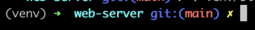
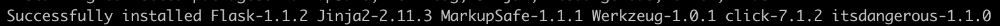
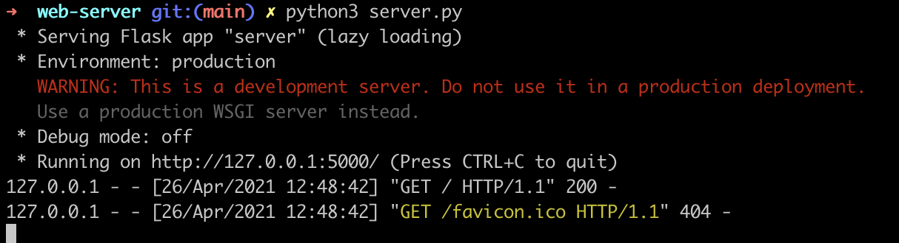
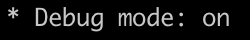
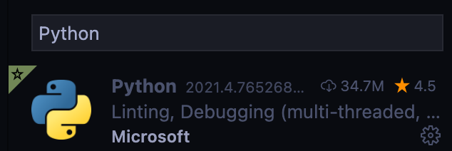

# Setting up a Flask Project

Flask framework is a simplistic and micro Python framework that is commonly used to build web servers. Follow this guide to setup the base application for Flask web server.

## Setup and Installation

Make sure to have an actively supported version (>=3.6) of Python 3 on your system.
To check if Python is installed on your system, open your terminal and type:
`python3 --version`

If you do have Python installed, you would get an output displaying the currently installed version of Python on your machine.

If you don't, no worries! Go through this guideline [here](https://github.com/Make-School-Labs/General-Project-Setup-Guide/tree/main/jupyter#install-with-anaconda) to install Python on your system.

### Setup a virtual environment with venv

* To setup a virtual environment:

  * In your terminal run the command `mkdir <your-project-directory>` to create a new project directory.
  * Navigate to your project directory `cd <your-project-directory>`.

    Python3 comes pre built with the `venv` module to create virtual environments. We create a virutal environment by running the command `python3 -m venv /path/to/new/virtual/environment`.

  * Run the command `python3 -m venv venv`.
 A new vitrual environment will be created in a folder called `venv`. The venv module will create a virtual python installation in the venv folder.

* Activate the environment:

  * Run the command `source venv/bin/activate`, `. venv/bin/activate` in  your terminal to activate the virtual environment.

    **Note:** this works for `zsh` and `bash` terminals. If you use any other please see list below or visit [here](https://docs.python.org/3/library/venv.html) to see guide on how to activate a virtual environment on your particular shell.

    | Shell    | Command |
    | ----------- | ----------- |
    | bash/zsh     | `$ source venv/bin/activate`|
    |fish | `$ source venv/bin/activate.fish`|
    |csh/tcsh| `$ source venv/bin/activate.csh`|
    |PowerShell Core | `$ venv/bin/Activate.ps1`|
    |cmd.exe | `C:\> venv\Scripts\activate.bat`|
    |PowerShell | `PS C:\> venv\Scripts\Activate.ps1`|

    Once your environment is activated, your prompt will now have an `venv` prefix that may look as follows:

    

    You can always deactivate the environment by typing `deactivate` in your terminal.

### Install Flask using pip

Pip is the package installer for `Python`. We can use `pip3` to install packages from the `Python` package Index - [PyPI](https://pypi.org/) and other indexes.

* Run `pip3 install Flask` to install flask so you can start using it in your project.

  You will get a prompt that looks like this on successful install:



## Building a Flask Server - Creating a Base Application

Now that you have the environment set up, let's start using Flask.  We will build a simple web server in a Python file.

In your project directory, open a new file and save it as `app.py` or something similar. **Make sure to not call it `flask.py` because this would conflict with Flask itself.**

We stick with `app.py` here.

* Include the following to the file:

```python
# import flask
from flask import Flask

# create an app instance
app = Flask(__name__)

# create a function - hello_world that returns an HTTP response - hello world
@app.route('/')
def hello_world():
    return 'Hello, World!'

# on running python3 app.py run the flask app
if __name__ == "__main__":
    app.run()
```

## Run the server

Run the server by running the `app.py` file.

In your terminal make sure you are in your project's directory and run the server with:

`python3 app.py`

You should get an output that looks like this:



Visit the URL shown on your terminal - <http://127.0.0.1:5000/> from your browser and you should see a 'Hello World!' text on display.

## Turn on debug mode

Notice that one of the items on your terminal output reads `Debug mode: off`. This is because the server runs in production mode by default. For development, we need the debug mode to be active.

To do this, we set `debug=True` in our `app.py` file.

* In your app file, replace the `app.run()` line to `app.run(debug=True)`
* Stop the running server(`Press CTRL+C`) and restart it again (`python3 app.py`)

You should see `Debug mode: on`. Now you can edit files, these changes will be detected and the server will be restarted automatically.



Well done! You have set up a simple flask web server.

## Python for VsCode

Virtual Studio Code (VsCode) is a powerful IDE that has very rich support for the `Python` language.

It has a extension that has features to make coding with Python a smoother experience. The extesnion has several helpful features like linting, debugging, refactoring etc.

The Python extension for VsCode is a nice to have tool. To install it:

* Open your VsCode IDE. Go the extensions pane (⇧⌘X) and search for `Python` in the list of extensions. The extension is maintained by Microsoft.



* Click on install and you would have it enabled. Check [here](https://code.visualstudio.com/docs/languages/python) for more about the features it offers.

## Other References

<https://flask.palletsprojects.com/en/1.1.x/>

<https://docs.python.org/3/library/venv.html>

<https://flask.palletsprojects.com/en/1.1.x/quickstart/>
