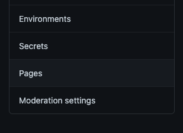
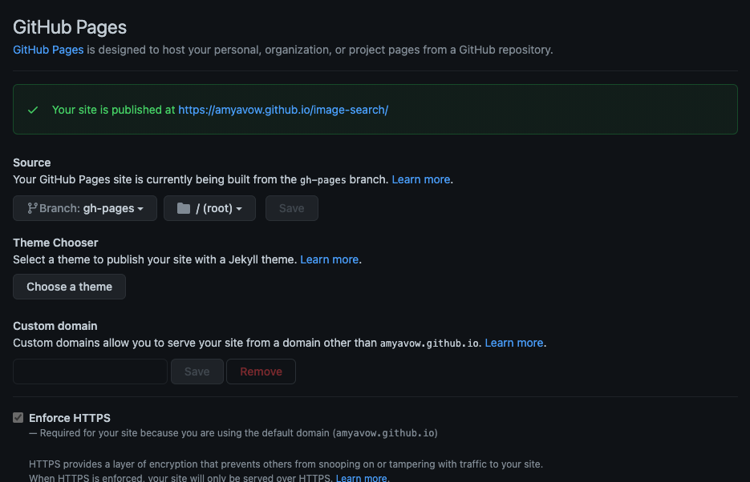

# Hosting Static Webpages on GitHub Pages

GitHub Pages is a static site hosting service. In this guide, we will walk through hosting a specific project hosted on GitHub. It is a simple process!!

## Getting Started

To host your site on GitHub Pages, you should have at least basic understanding of:

* Git and Git commands. Check out this [handy guide](https://www.atlassian.com/git/tutorials/atlassian-git-cheatsheet) for a refresher.
* GitHub. Check out this [guide](https://guides.github.com/activities/hello-world/)

## Enable GitHub Pages on a GitHub Repo

Before we get started know that you should have some static web content that you would like to host.
That content should also be hosted on a GitHub repository.

Once you have committed your content up in a GitHub repo, you will need to configure where in your repository GitHub should serve the content from.

We recommend you serve content from the root folder of the branch `gh-pages` branch:

* Create the `gh-pages` branch and  push it to your repository. On your terminal, make sure your have navigated to your project directory, run these commands:

```bash
git checkout -b gh-pages
git push -u origin gh-pages
```

* Go to your GitHub Repository, click on the settings tab right at the top of the page


* To the left of the page scroll down the menu to the `Pages` link and click on it



* The branch should be configured to `gh-pages` and the folder to `/(root)`. Like the screenshot below:



Take note of the site address your content was pubilshed at.

It will typically follow the format  - <https://{your-githubusername}.github.io/{name-of-your-repository}/>.

Navigate to the site url published for you and viola! you have your content up and publicly visible.

## Deploying to GitHub Pages using GitHub action

You can set up your site so that it is updated automatically every time your source code is updated.
To do this, GitHub Actions come in very handy.

Follow the instructions in the  guide [here](https://github.com/marketplace/actions/deploy-to-github-pages) to go through with this process.

## Other References

<https://docs.github.com/en/pages>

<https://github.com/features/actions>
